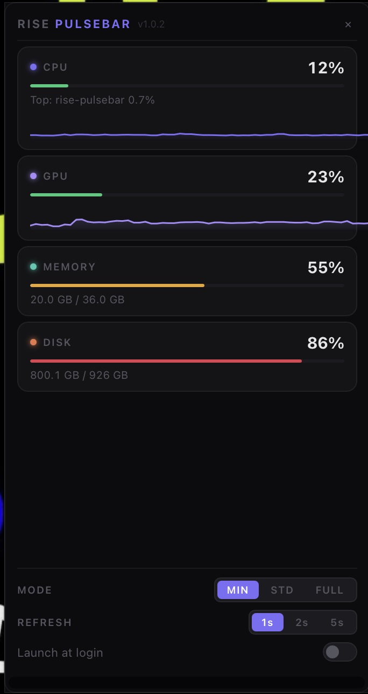
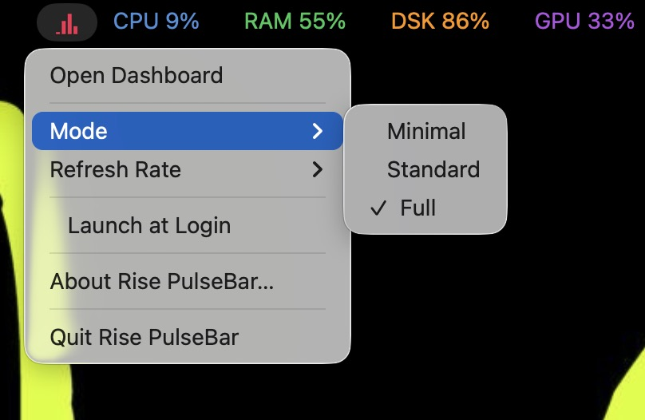
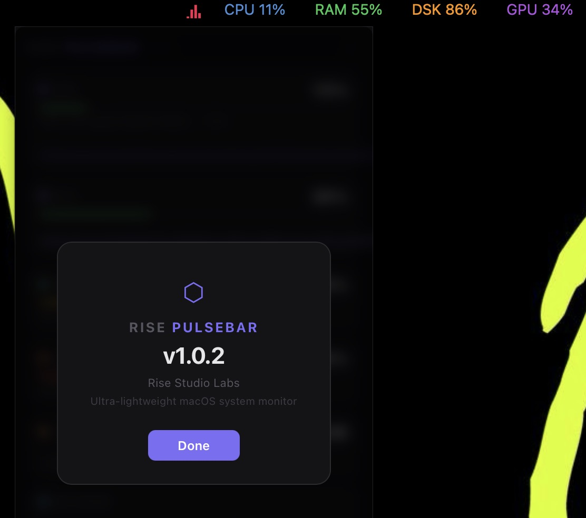

# RISE PulseBar

RISE PulseBar is a real-time system monitor for macOS with a clean, minimal interface. Track CPU, memory, disk, GPU, and network stats directly from your menu bar — fast, private, and distraction-free. No tracking. No noise. Brought to you by **RISE Studio Labs**.


## Features

- **Native colored metrics** — CPU (blue), RAM (green), DSK (orange), GPU (purple) displayed as individual colored text items in the menu bar
- **Live animated icon** — hot pink 4-bar chart animates in real-time with CPU/RAM/DSK/GPU values
- **GPU monitoring** — Apple Silicon GPU utilization via IOKit; hides gracefully on unsupported hardware
- **Disk monitoring** — boot volume usage (ignores external drives)
- **Top process** — shows the most CPU-hungry process and its usage
- **Sparklines** — 60-second rolling history graphs for CPU and GPU
- **Network** — real-time download / upload speeds
- **Draggable dashboard** — click the tray icon to open, drag the header to reposition
- **3 display modes** — Minimal (CPU only), Standard (CPU + RAM), Full (all metrics)
- **Settings** — mode, refresh rate, and launch-at-login from right-click menu or in-panel controls
- **Fully local** — no cloud, no analytics, no telemetry, no accounts





## Performance

| Metric | Target | Actual |
|---|---|---|
| CPU usage | < 2% | ~0.3% idle |
| Memory | < 80 MB | ~45 MB |
| Panel open | < 100 ms | instant |

## Install

1. Download `Rise PulseBar_1.0.2_aarch64.dmg` from [Releases](https://github.com/chaser1-ops/RISEPulseBar/releases)
2. Open the DMG, drag **Rise PulseBar** to **Applications**
3. Launch from Applications
4. Click the menu bar item to open the dashboard

See [INSTALL.md](INSTALL.md) for build-from-source, signing, and notarization instructions.

## Usage

| Action | Result |
|---|---|
| Left-click menu bar | Open / close dashboard |
| Right-click menu bar | Mode, refresh rate, launch at login, about, quit |
| Mode: MIN | CPU only in menu bar |
| Mode: STD | CPU + RAM in menu bar |
| Mode: FULL | CPU + RAM + DSK + GPU in menu bar |

## Build from Source

```bash
# Prerequisites: Rust 1.77+, Tauri CLI 2.x, Xcode Command Line Tools
git clone https://github.com/chaser1-ops/RISEPulseBar
cd RISEPulseBar
cargo tauri build
```

## Requirements

- macOS 12.0 (Monterey) or later
- Apple Silicon or Intel Mac

## License

MIT

---

**[RISE Studio Labs](https://risestudiolabs.com)** — lightweight tools, zero noise.
